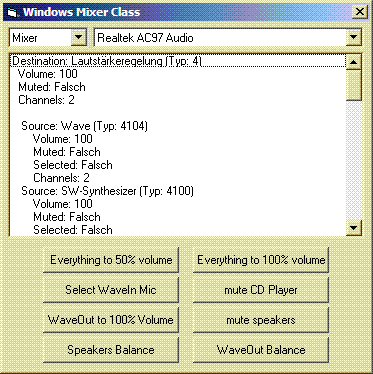



## Audio Mixer Control Class

### Description

This class lets you easily modify the volume or balance of Mixer lines or the whole playback/recording

and also lets you select the recording source.
 
### More Info
 

             |
---                |---
**Submitted On**   |2006-06-19 16:35:32
**By**             |[Arne Elster](https://github.com/Planet-Source-Code/PSCIndex/blob/master/ByAuthor/arne-elster.md)
**Level**          |Intermediate
**User Rating**    |5.0 (30 globes from 6 users)
**Compatibility**  |VB 6\.0
**Category**       |[Sound/MP3](https://github.com/Planet-Source-Code/PSCIndex/blob/master/ByCategory/sound-mp3__1-45.md)
**World**          |[Visual Basic](https://github.com/Planet-Source-Code/PSCIndex/blob/master/ByWorld/visual-basic.md)
**Archive File**   |[Audio\_Mixe2028551122006\.zip](https://github.com/Planet-Source-Code/arne-elster-audio-mixer-control-class__1-66975/archive/master.zip)

